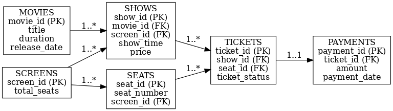

# 🎬 Movie Ticket Booking

This project provides a **complete Oracle database schema** and **PL/SQL business logic** for a **Movie Ticket Booking System**.
It covers schema design, constraints, packages, triggers, and supporting objects to ensure data consistency and enforce business rules.

---

## 📂 Project Structure

| Folder                                                     | Description                                                                                                                             |
| ---------------------------------------------------------- | --------------------------------------------------------------------------------------------------------------------------------------- |
| [01.Table Releted Objects](./01.Table%20Releted%20Objects) | Contains SQL scripts for creating schema-level objects like **tables, sequences, indexes, views, and clusters**.                        |
| [02.PL-SQL Objects](./02.PL-SQL%20Objects)                 | Contains PL/SQL objects including **packages** for booking, reporting, admin management, and **triggers** for enforcing business rules. |

---

## 📑 Folder Details

### 1. [01.Table Releted Objects](./01.Table%20Releted%20Objects)

This folder sets up the **core schema** of the booking system.

Files:

* **01.tables.sql** → Defines tables like `movies`, `screens`, `seats`, `shows`, `tickets`, and `payments`.
* **02.sequences.sql** → Auto-generating keys for entities (e.g., movie\_id, ticket\_id).
* **03.indexes.sql** → Improves query performance for frequently accessed columns.
* **04.views.sql** → Provides logical views for simplified reporting.
* **05.clusters.sql** → Groups related tables for better storage management.

---

### 2. [02.PL-SQL Objects](./02.PL-SQL%20Objects)

Implements **business rules and logic** using packages and triggers.

#### 📦 Packages

* **admin\_mgmt\_pkg.sql** → Admin operations, booking controls, and revenue calculation.
* **booking\_pkg.sql** → Core booking logic for customers.
* **customer\_view\_pkg.sql** → Customer-oriented queries and simplified views.
* **display\_pkg.sql** → Handles display operations for movies, shows, and tickets.
* **reporting\_pkg.sql** → Generates business and revenue reports.
* **theater\_report\_pkg.sql** → Focused reports at the theater/screen level.

#### 🔔 Triggers

* **Movie-level** → Prevent invalid or duplicate movie entries.
* **Screen & Seat-level** → Enforce seat capacity and prevent duplicate seats.
* **Show-level** → Ensure show timings are valid and avoid overlaps.
* **Ticket-level** → Prevent overbooking, double booking, and invalid seat mapping.
* **Payment-level** → Validate ticket payments and enforce booking status.

---
## 🗄️ Database Schema Overview

The schema is designed to handle core functionalities of a ticket booking system:

- **Movies** → Store movie details (title, release date, duration).  
- **Screens** → Represents cinema screens with total seat capacity.  
- **Seats** → Seats available in each screen.  
- **Shows** → Scheduled shows for movies in specific screens at given times.  
- **Tickets** → Bookings for seats in a show.  
- **Payments** → Tracks ticket payments.

---


## 🔗 Entity-Relationship (ER) Diagram

Below is the ER diagram representing the relationships between the main entities:



### Relationships:
- A **Movie** can have multiple **Shows**.  
- A **Screen** contains many **Seats** and hosts multiple **Shows**.  
- A **Show** is linked to one **Movie** and one **Screen**, and has many **Tickets**.  
- A **Ticket** is tied to one **Show** and one **Seat**.  
- A **Payment** is linked to a **Ticket**.

---
## 🚀 How to Use

Clone the repository:

```bash
git clone https://github.com/SonaniAkshit/Oracle.git
cd "Oracle/Movie Ticket Booking for Server schema"
```


1. Run scripts from **01.Table Releted Objects** to create schema objects.
2. Run **02.PL-SQL Objects** to enable packages and triggers.
3. Start testing by inserting sample data and calling booking/reporting packages.

---